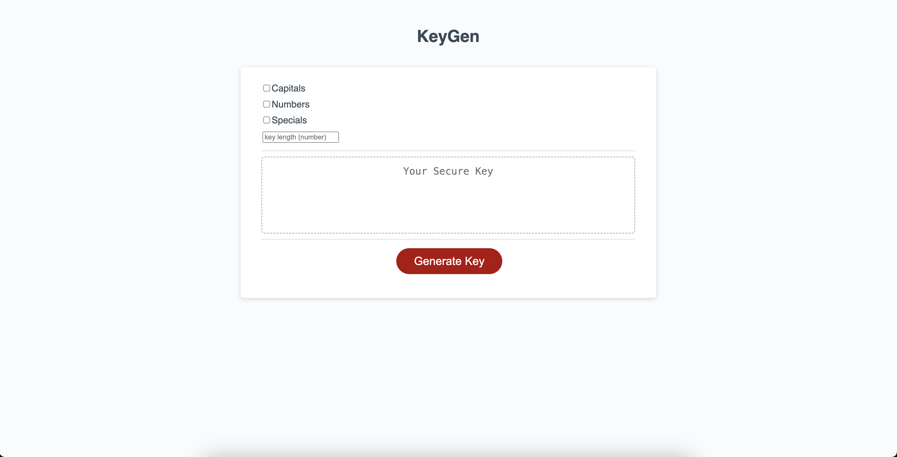

# KeyGen

## Description

I wrote this application to assist those who may be looking to secure their online accounts.
It solves this problem by generating a random key based on the selected charaters and the 
set key length. Through writing this app, I learned how to streamline my use of javascript.

## Usage

1. Select which sets of characters you'd like to include in your key. (defaults to only lowercase letters)
2. Set the number of characters you'd like to have in your key.
3. Click "Generate Key"
4. Copy/paste it into whatever password you're making/changing.
5. Save it in your password manager, because these will be literally impossible to remember. ;)

## Credits

W3 Schools - https://www.w3schools.com/jquery/default.asp

## License

MIT License - See repository for more info.

## Preview

